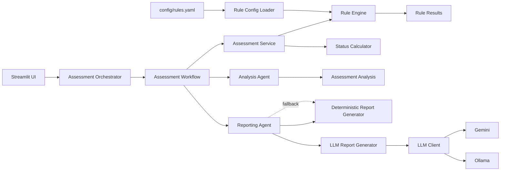

# Architecture Decision Records

This document captures the main architectural decisions behind the Credit Assessment System.

The purpose of these records is to document **why** the system is designed in its current form, not only how individual components are implemented.

## Decision Status

| ID | Decision | Status |
|---|---|---|
| ADR-001 | Deterministic Rule Engine as Decision Authority | Accepted |
| ADR-002 | Separation of Decision and Reporting Layers | Accepted |
| ADR-003 | Externalized Rule Configuration | Accepted |
| ADR-004 | Pluggable Rule Architecture and Registry | Accepted |
| ADR-005 | Provider-Agnostic LLM Abstraction | Accepted |
| ADR-006 | Deterministic Fallback for AI Reporting | Accepted |
| ADR-007 | Immutable Domain Models | Accepted |
| ADR-008 | Thin Presentation Layer | Accepted |

---

# ADR-001 — Deterministic Rule Engine as Decision Authority

## Status

Accepted

## Context

Credit assessment requires reproducible and explainable outcomes. The system evaluates financial indicators against explicit business rules and produces structured findings and an overall assessment status.

An LLM is probabilistic and is therefore not an appropriate source of truth for the underlying credit assessment.

## Decision

The **deterministic Rule Engine is the sole decision authority**.

It is responsible for:

- evaluating credit rules;
- producing rule-level results;
- determining whether a rule is triggered, not triggered, or not evaluable;
- applying severity policies;
- providing the inputs used to calculate the overall assessment status.

LLM components must not modify, override, or reinterpret the assessment results.

## Rationale

This provides deterministic execution, reproducibility, traceability, and a clear separation between business logic and generative AI.

The architecture therefore follows the principle:

> **The system decides; the AI explains.**

## Consequences

### Positive

- Assessment results are reproducible.
- Business rules remain explicit and testable.
- Rule-level evidence can be exposed to users.
- LLM failures do not change the underlying assessment.
- The boundary of AI responsibility is clearly defined.

### Trade-offs

- New risk signals must be implemented as explicit rules or deterministic logic.
- The system does not use an LLM as a flexible end-to-end scoring mechanism.

## Alternatives Considered

### End-to-end LLM assessment

Rejected because the decision would be probabilistic and harder to reproduce, validate, and audit.

### LLM-assisted scoring

Rejected for the current scope because allowing generated output to influence the assessment would weaken the separation between decision logic and narrative generation.

---

# ADR-002 — Separation of Decision and Reporting Layers

## Status

Accepted

## Context

The system has two distinct responsibilities:

1. determine the credit assessment;
2. communicate the assessment in a human-readable form.

Combining these responsibilities would make the business logic harder to test and would allow presentation concerns to influence the decision process.

## Decision

The application separates the workflow into distinct layers:

```text
AssessmentService
      |
      v
   Assessment
      |
      v
 AnalysisAgent
      |
      v
AssessmentAnalysis
      |
      v
 ReportingAgent
      |
      +----> DeterministicReportGenerator
      |
      +----> LLMReportGenerator
```

`AssessmentService` owns the deterministic assessment. `AnalysisAgent` structures the assessment findings into an analysis object. `ReportingAgent` transforms that analysis into a user-facing report.

## Rationale

Each component has a focused responsibility and can be tested independently.

## Consequences

### Positive

- Clear separation of concerns.
- Easier unit testing.
- Reporting implementations can evolve independently from assessment logic.
- Different reporting strategies can consume the same deterministic assessment.

### Trade-offs

- The workflow contains more components than a monolithic implementation.
- Domain objects and interfaces are required to connect the layers.

## Alternatives Considered

### Monolithic assessment-and-reporting service

Rejected because it would couple business rules, analysis, and presentation logic.

---

# ADR-003 — Externalized Rule Configuration

## Status

Accepted

## Context

Credit rules contain parameters such as thresholds, severity levels, and severity directions. These values may change independently from the implementation of the rule itself.

Hard-coding all parameters inside Python classes would increase maintenance cost and make configuration changes unnecessarily invasive.

## Decision

Rule parameters are externalized in `config/rules.yaml` and loaded through a dedicated configuration layer.

The configuration is validated and converted into immutable `RuleConfig` objects before being consumed by the Rule Engine.

## Rationale

This separates **rule implementation** from **rule parameters**.

A developer can modify a threshold or severity configuration without rewriting the evaluation algorithm, while validation prevents malformed configurations from silently entering the assessment workflow.

## Consequences

### Positive

- Business parameters are centralized.
- Configuration changes are easier to review.
- Rule implementations remain reusable.
- Configuration validation provides an additional safety boundary.

### Trade-offs

- YAML becomes an additional artifact that must be versioned and validated.
- Configuration errors must be handled explicitly.

## Alternatives Considered

### Hard-coded thresholds

Rejected because changes to business parameters would require code modifications.

### Database-only configuration

Not selected for the current scope because version-controlled configuration is simpler and easier to reproduce locally.

---

# ADR-004 — Pluggable Rule Architecture and Registry

## Status

Accepted

## Context

A credit assessment system is expected to evolve by adding new indicators and rules. The core assessment workflow should not need to be rewritten every time a new rule is introduced.

## Decision

Rules follow a common abstraction and are resolved through a registry/discovery mechanism using their configured `rule_id`.

The rule registry is responsible for connecting configuration entries with their corresponding rule implementations.

## Rationale

This follows an extensibility-oriented design: new rules can be added without introducing rule-specific branching into the central assessment service.

## Consequences

### Positive

- New rules can be introduced independently.
- The central workflow remains stable.
- Rule implementations can be tested in isolation.
- Configuration and implementation remain loosely coupled.

### Trade-offs

- Registration/discovery conventions must be maintained.
- Debugging an incorrectly registered rule can be less direct than calling a class explicitly.

## Alternatives Considered

### Central `if/elif` rule dispatcher

Rejected because it would create a growing central dependency on every individual rule.

### Hard-coded rule list

Rejected because it reduces extensibility and couples the orchestration layer to concrete rule implementations.

---

# ADR-005 — Provider-Agnostic LLM Abstraction

## Status

Accepted

## Context

The reporting layer may use different LLM providers depending on deployment requirements, cost, privacy considerations, or local development needs.

The application should not depend directly on one specific provider implementation.

## Decision

LLM access is defined through the `LLMClient` abstraction, with provider-specific implementations such as Gemini and Ollama behind that interface.

The reporting workflow depends on the abstraction rather than on a concrete provider.

## Rationale

This provides provider portability and keeps infrastructure concerns outside the reporting domain logic.

It also allows local models to be used during development while retaining the option of an external provider.

## Consequences

### Positive

- Providers can be replaced with limited impact on the application layer.
- Local and external LLM implementations can coexist.
- Provider integrations can be tested independently.
- Vendor lock-in is reduced at the application boundary.

### Trade-offs

- Provider-specific capabilities may need to be abstracted or intentionally excluded.
- Multiple implementations require additional integration testing.

## Alternatives Considered

### Direct provider calls from the ReportingAgent

Rejected because it would couple application logic to a specific LLM provider.

---

# ADR-006 — Deterministic Fallback for AI Reporting

## Status

Accepted

## Context

LLM services can be unavailable because of network failures, provider errors, authentication problems, local model failures, or configuration issues.

A reporting failure should not prevent the system from producing a useful assessment report when the deterministic assessment has already succeeded.

## Decision

LLM-based reporting uses a **deterministic report generator as a fallback**.

The fallback affects only report generation. It does not alter the underlying assessment or findings.

## Rationale

The architecture treats AI as an enhancement to the reporting experience rather than as a mandatory dependency of the credit assessment process.

## Consequences

### Positive

- The application remains usable when an LLM provider is unavailable.
- Deterministic reporting provides a stable baseline.
- Operational failures are isolated from the assessment engine.

### Trade-offs

- The fallback report may be less natural or detailed than an LLM-generated report.
- Both deterministic and LLM reporting paths must be maintained and tested.

## Alternatives Considered

### Fail the complete workflow when the LLM is unavailable

Rejected because reporting availability should not determine whether the deterministic assessment can be delivered.

---

# ADR-007 — Immutable Domain Models

## Status

Accepted

## Context

Assessment results are passed through multiple layers. Accidental mutation of structured assessment data could create inconsistencies between the decision, analysis, and report.

## Decision

Core domain and analysis/reporting objects that represent assessment state use immutable data structures where appropriate, including frozen dataclasses.

## Rationale

Immutability makes data flow easier to reason about and reduces the risk that downstream components silently modify facts produced by upstream components.

## Consequences

### Positive

- Safer data flow between layers.
- Reduced risk of accidental state mutation.
- Easier reasoning about component boundaries.
- Better alignment with deterministic processing.

### Trade-offs

- Transformations require creation of new objects rather than in-place mutation.
- Developers must be deliberate when constructing updated domain state.

## Alternatives Considered

### Mutable shared domain objects

Rejected because they increase the possibility of hidden state changes across workflow stages.

---

# ADR-008 — Thin Presentation Layer

## Status

Accepted

## Context

The project uses Streamlit as its presentation layer. Streamlit is useful for interactive exploration and demonstration, but business logic should remain independent from the UI framework.

## Decision

The `app/` layer is responsible for presentation, interaction, and workflow composition, while the core assessment logic remains in `src/`.

Business rules, assessment calculations, domain models, and LLM abstractions must not depend on Streamlit.

## Rationale

This keeps the core system reusable and testable outside the web interface.

The same assessment workflow can therefore be invoked independently of the presentation layer.

## Consequences

### Positive

- Business logic remains framework-independent.
- Testing does not require a Streamlit runtime.
- The application can evolve toward alternative interfaces in the future.
- The UI remains focused on communicating results and collecting user input.

### Trade-offs

- Presentation code requires explicit adapters between UI state and domain objects.
- Some UI-specific convenience logic cannot be placed directly in the domain layer.

## Alternatives Considered

### Business logic directly inside Streamlit pages

Rejected because it would tightly couple the assessment engine to the presentation framework.

---

# Architecture Principles

The decisions above imply the following principles for future development:

1. **Deterministic logic owns the decision.**
2. **AI is bounded to narrative generation and summarisation.**
3. **Business rules should be explicit, testable, and configurable.**
4. **Components communicate through well-defined domain objects.**
5. **Infrastructure and LLM providers should remain replaceable.**
6. **Failure of an optional AI component must not invalidate the deterministic assessment.**
7. **Presentation code should not own business logic.**
8. **Architectural changes should preserve reproducibility and explainability.**

# Current Architecture

At a high level, the current system follows this flow:



The architecture intentionally keeps the **assessment path deterministic** and makes the **LLM path optional and replaceable**.

## Future Decisions

Future ADRs may cover topics such as:

- persistence and database architecture;
- API exposure;
- authentication and authorisation;
- observability and structured logging;
- automated model/rule validation;
- deployment architecture;
- CI/CD and release strategy.

These decisions should be documented when the corresponding architectural concerns become part of the system scope.
