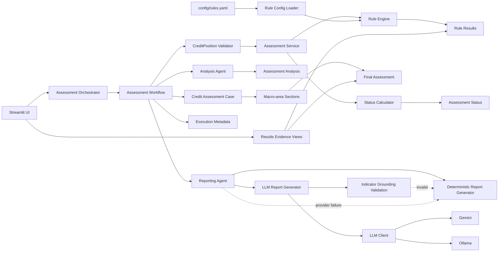

# Architecture Decision Records

This document captures the main architectural decisions behind the Credit Assessment System and explains why the system is structured as it is.

## Decision Status

| ID | Decision | Status |
|---|---|---|
| ADR-001 | Deterministic Rule Engine as Decision Authority | Accepted |
| ADR-002 | Separation of Decision and Reporting Layers | Accepted |
| ADR-003 | Externalized Rule Configuration | Accepted |
| ADR-004 | Pluggable Rule Architecture and Registry | Accepted |
| ADR-005 | Provider-Agnostic LLM Abstraction | Accepted |
| ADR-006 | Deterministic Fallback for AI Reporting | Accepted |
| ADR-007 | Immutable Domain Models | Accepted |
| ADR-008 | Thin Presentation Layer | Accepted |
| ADR-009 | Execution Observability and Provenance | Accepted |
| ADR-010 | Grounded LLM Narrative Contract | Accepted |
| ADR-011 | Evidence-Oriented Results UI | Accepted |
| ADR-012 | Structural Input Validation Before Assessment | Accepted |
| ADR-013 | Explicit Handling of All-`NOT_EVALUABLE` Assessments | Accepted |

---

# ADR-001 — Deterministic Rule Engine as Decision Authority

## Status

Accepted

## Decision

The **deterministic Rule Engine is the decision authority for financial rule assessment**. It evaluates rules, produces `RuleResult` objects, resolves severity and provides the inputs used to calculate financial assessment status.

The case-level `FinalAssessmentService` is likewise deterministic and consolidates macro-area section statuses. LLM components must not modify, override or reinterpret either structured decision.

## Rationale

This provides deterministic execution, reproducibility, traceability and a clear separation between business logic and generative AI.

> **The system decides; the AI explains.**

---

# ADR-002 — Separation of Decision and Reporting Layers

## Status

Accepted

## Decision

The workflow separates:

```text
AssessmentService
      ↓
Assessment
      ↓
AnalysisAgent
      ↓
AssessmentAnalysis
      ↓
ReportingAgent
```

Reporting implementations consume deterministic analysis objects rather than accessing the rule engine directly.

## Rationale

Each component has a focused responsibility and can be tested independently.

---

# ADR-003 — Externalized Rule Configuration

## Status

Accepted

## Decision

Rule parameters such as thresholds, severity and severity direction are defined in `config/rules.yaml` and loaded through a dedicated configuration layer.

## Rationale

This separates **rule implementation** from **rule parameters**, making business-policy changes easier to review and reproduce.

---

# ADR-004 — Pluggable Rule Architecture and Registry

## Status

Accepted

## Decision

Rules follow a common abstraction and are resolved through a registry/discovery mechanism using their configured `rule_id`.

## Rationale

New indicators can be introduced without adding rule-specific branches to the central assessment service.

---

# ADR-005 — Provider-Agnostic LLM Abstraction

## Status

Accepted

## Decision

LLM access is defined through the `LLMClient` abstraction, with provider-specific implementations such as Gemini, Ollama and a mock client.

## Rationale

This provides provider portability and keeps infrastructure concerns outside reporting-domain logic.

---

# ADR-006 — Deterministic Fallback for AI Reporting

## Status

Accepted

## Decision

LLM-based reporting uses a **deterministic report generator as fallback** when the primary reporting path fails or, when strict grounding is enabled, when the generated narrative does not contain required indicator evidence.

The fallback changes only the report-generation path. It does not alter the assessment, findings or final case decision.

## Rationale

AI is treated as an enhancement to reporting rather than a mandatory dependency of the credit assessment.

---

# ADR-007 — Immutable Domain Models

## Status

Accepted

## Decision

Core assessment, analysis, report and execution-state objects use immutable data structures where appropriate, including frozen dataclasses.

## Rationale

Immutability reduces the risk that downstream components silently modify facts produced by upstream deterministic processing.

---

# ADR-008 — Thin Presentation Layer

## Status

Accepted

## Decision

`app/` is responsible for presentation, interaction and workflow composition. Business rules, assessment calculations, domain models and LLM abstractions remain in `src/`.

The UI consumes structured domain objects and does not reproduce decision logic.

## Rationale

This keeps the core system reusable and testable outside Streamlit.

---

# ADR-009 — Execution Observability and Provenance

## Status

Accepted

## Decision

Successfully completed workflow executions expose immutable `ExecutionMetadata` containing execution identity, timestamp, reporting mode, generator used, fallback state, error category and phase timings.

Observability is exposed in the Streamlit audit area but does not participate in the credit decision.

## Rationale

This provides execution-level traceability without coupling the current application to persistent observability infrastructure.

> **Observability describes the workflow; it does not decide the credit outcome.**

---

# ADR-010 — Grounded LLM Narrative Contract

## Status

Accepted

## Decision

The LLM reporting prompt establishes a constrained narrative contract. Supplied material findings and numerical indicators must remain represented; values must not be rounded, recalculated or converted; unsupported facts and causal explanations must not be invented; category order and repetition are controlled; and the LLM does not generate the assessment status.

When strict indicator grounding is enabled, generated narrative is checked against deterministic indicator values. Missing required values cause deterministic fallback.

## Rationale

This creates a practical control between deterministic evidence and generative language without attempting full semantic verification of arbitrary natural-language output.

---

# ADR-011 — Evidence-Oriented Results UI

## Status

Accepted

## Decision

The Streamlit Results view follows a progressive analyst-oriented hierarchy:

```text
Executive Credit Assessment
          ↓
Final Assessment
          ↓
Risk Drivers
          ↓
Rule Engine Evidence
          ↓
Executive Narrative
          ↓
Detailed Analysis by Macro-area
```

The **Executive Credit Assessment** is the primary decision surface. **Final Assessment** shows deterministic macro-area consolidation. **Risk Drivers** highlights triggered indicators across areas. **Rule Engine Evidence** provides detailed rule distributions, filters and individual rule inspection. **Executive Narrative** provides management-level prose. The final drill-down contains detailed macro-area evidence and data-quality information.

Technical tables and detailed inspections are closed by default where appropriate. The UI therefore exposes evidence progressively rather than presenting every technical object at once.

All visualizations consume deterministic workflow outputs. They do not recalculate thresholds, severity or assessment status.

The Risk Drivers ranking is descriptive and does not introduce a new score.

## Rationale

The hierarchy separates **decision, drivers, evidence, narrative and audit detail**. This makes the assessment easier to read for an analyst while preserving traceability and avoiding duplicate evidence surfaces.

---

# ADR-012 — Structural Input Validation Before Assessment

## Status

Accepted

## Context

The deterministic Rule Engine assumes that the incoming `CreditPosition` has the expected structure. Without an explicit validation boundary, malformed objects, non-numeric values or non-finite numbers could enter the assessment path and produce unsafe or misleading outcomes.

At the same time, generic validation should not encode credit-policy assumptions that belong to individual rules.

## Decision

Introduce `CreditPositionValidator` as a dedicated structural validation service invoked by `AssessmentService` before Rule Engine evaluation.

The validator checks:

- the input is a `CreditPosition` instance;
- `position_id` is non-empty;
- financial fields are numeric or `None`;
- booleans are rejected where numeric values are expected;
- `NaN` and positive/negative infinity are rejected.

`None` is accepted because missing information is a valid domain condition and can result in `NOT_EVALUABLE` at rule level.

The validator does **not** enforce generic sign constraints on financial values. Economic semantics remain the responsibility of the corresponding rule.

## Rationale

This establishes a clean separation between input integrity and credit-risk business semantics. It also makes malformed-input behavior independently testable.

## Consequences

### Positive

- Invalid structural input is rejected before assessment.
- Non-finite numerical values cannot silently propagate.
- Business rules remain responsible for business semantics.
- Validation can be tested independently and injected into the assessment service.

### Trade-offs

- Validation introduces an additional service boundary.
- Domain-specific validation remains distributed across individual rules by design.

---

# ADR-013 — Explicit Handling of All-`NOT_EVALUABLE` Assessments

## Status

Accepted

## Context

The rule engine distinguishes `NOT_TRIGGERED` from `NOT_EVALUABLE`. If every configured rule is `NOT_EVALUABLE`, interpreting the result as `NORMAL` would incorrectly equate absence of evidence with evidence of normal credit quality.

## Decision

Keep the existing three assessment statuses and classify an assessment with results where **all rules are `NOT_EVALUABLE`** as `ATTENTION`.

The current status precedence is:

```text
2+ TRIGGERED
      ↓
   CRITICAL

1 TRIGGERED
      ↓
  ATTENTION

0 TRIGGERED + ALL NOT_EVALUABLE
      ↓
  ATTENTION

0 TRIGGERED + at least one evaluable rule
      ↓
   NORMAL
```

An empty rule-result collection remains `NORMAL` for backward-compatible service behavior; it is distinct from an actual evaluation in which every configured rule is non-evaluable.

## Rationale

This preserves the distinction between **no detected risk signal** and **insufficient evaluable evidence** without introducing a fourth assessment status.

## Consequences

### Positive

- Data-availability problems are no longer silently interpreted as normal credit quality.
- The rule-level `NOT_EVALUABLE` semantics are reflected at assessment level.
- The existing three-status model remains unchanged.

### Trade-offs

- `ATTENTION` can represent either a single triggered rule or insufficient evaluable evidence; downstream explanations must therefore expose rule-level evidence.

---

# Architecture Principles

The decisions above imply the following principles:

1. **Deterministic logic owns the decision.**
2. **Input integrity is validated before rule evaluation.**
3. **AI is bounded to narrative generation.**
4. **Material narrative evidence must remain grounded in deterministic findings.**
5. **`NOT_EVALUABLE` is distinct from `NOT_TRIGGERED`.**
6. **Business rules should be explicit, testable and configurable.**
7. **Components communicate through well-defined domain objects.**
8. **Infrastructure and LLM providers should remain replaceable.**
9. **Failure of an optional AI component must not invalidate the deterministic assessment.**
10. **Presentation code should not own business logic.**
11. **Execution provenance should remain immutable and separate from decision data.**
12. **The UI should explain the decision path without reproducing it.**
13. **Executive information should be visible first; technical evidence should be progressively disclosed.**

# Current Architecture



The architecture intentionally keeps the **assessment path structurally validated and deterministic**, the **case-level aggregation deterministic**, the **LLM path optional and bounded**, the **fallback path deterministic**, and **execution metadata observational rather than decisional**.
