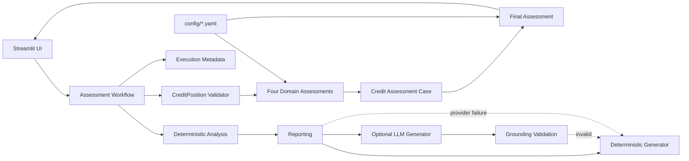

# Architecture Decision Records

This document records the architectural decisions that define the Credit Assessment System.

## Decision Status

| ID | Decision | Status |
|---|---|---|
| ADR-001 | Deterministic Rule Engine as Decision Authority | Accepted |
| ADR-002 | Separation of Decision and Reporting Layers | Accepted |
| ADR-003 | Externalized Rule Configuration | Accepted |
| ADR-004 | Pluggable Rule Architecture and Registry | Accepted |
| ADR-005 | Provider-Agnostic LLM Abstraction | Accepted |
| ADR-006 | Deterministic Fallback for AI Reporting | Accepted |
| ADR-007 | Immutable Domain Models | Accepted |
| ADR-008 | Thin Presentation Layer | Accepted |
| ADR-009 | Execution Observability and Provenance | Accepted |
| ADR-010 | Grounded LLM Narrative Contract | Accepted |
| ADR-011 | Evidence-Oriented Results UI | Accepted |
| ADR-012 | Structural Input Validation Before Assessment | Accepted |
| ADR-013 | Explicit Handling of All-`NOT_EVALUABLE` Assessments | Accepted |
| ADR-014 | Multi-Domain Case Assessment | Accepted |
| ADR-015 | Severity-Based Risk Driver Presentation | Accepted |
| ADR-016 | Application-Controlled Executive Narrative Structure | Accepted |

---

# ADR-001 — Deterministic Rule Engine as Decision Authority

**Decision:** Deterministic assessment services are the decision authority. `FinalAssessmentService` is the authority for cross-domain case aggregation. LLM components cannot modify or override either structured decision.

**Rationale:** Determinism, reproducibility, traceability and separation of business logic from generative AI.

> **The system decides; the AI explains.**

# ADR-002 — Separation of Decision and Reporting Layers

**Decision:** Assessment, deterministic analysis and reporting are separate stages. Reporting consumes structured deterministic analysis rather than accessing rule logic directly.

**Rationale:** Focused responsibilities and independently testable components.

# ADR-003 — Externalized Rule Configuration

**Decision:** Rule parameters such as thresholds, severity and severity direction are externalized under `config/` and loaded through configuration services.

**Rationale:** Business-policy changes remain separate from implementation logic and are easier to review and reproduce.

# ADR-004 — Pluggable Rule Architecture and Registry

**Decision:** Rules share common abstractions and are resolved through registry/discovery mechanisms using configured rule identifiers.

**Rationale:** New indicators can be added without rule-specific branching in central services.

# ADR-005 — Provider-Agnostic LLM Abstraction

**Decision:** LLM access is exposed through `LLMClient`, with provider-specific implementations such as Gemini, Ollama and a mock client.

**Rationale:** Provider portability and isolation of infrastructure concerns from reporting-domain logic.

# ADR-006 — Deterministic Fallback for AI Reporting

**Decision:** LLM reporting falls back to a deterministic generator when the primary path fails or, when configured, when required indicator grounding fails.

**Rationale:** AI is an optional enhancement to reporting, not a dependency of credit assessment.

# ADR-007 — Immutable Domain Models

**Decision:** Core assessment, analysis, report and execution-state objects use immutable structures where appropriate.

**Rationale:** Downstream components should not silently mutate deterministic facts.

# ADR-008 — Thin Presentation Layer

**Decision:** `app/` owns presentation, interaction and workflow composition. Business rules, assessment calculations, domain models and LLM abstractions remain in `src/`.

**Rationale:** The core remains reusable and testable outside Streamlit.

# ADR-009 — Execution Observability and Provenance

**Decision:** Successful workflow executions expose immutable execution metadata containing execution identity, UTC timestamp, reporting mode, generator/fallback state, error category where applicable and phase timings.

**Rationale:** Execution-level traceability without coupling the application to persistent observability infrastructure.

> **Observability describes the workflow; it does not decide the credit outcome.**

# ADR-010 — Grounded LLM Narrative Contract

**Decision:** LLM reporting must preserve supplied material findings and numerical evidence, avoid unsupported facts and causal explanations, and never generate the structured assessment status. Strict grounding can require supplied indicator values to appear in the narrative.

**Rationale:** A bounded control is needed between deterministic evidence and generative language without transferring decision authority to the model.

# ADR-011 — Evidence-Oriented Results UI

**Decision:** The Results view follows a progressive hierarchy:

```text
Executive Credit Assessment
          ↓
Assessment by Macro-Area
          ↓
Executive Narrative
          ↓
Risk Drivers (collapsed)
          ↓
Detailed Assessment (collapsed)
          ↓
Rule Catalogue & Filters (collapsed)
          ↓
Individual Rule Detail (collapsed)
```

The four macro-area sections are the authoritative visible deterministic overview. Technical detail is progressively disclosed rather than repeated through multiple aggregate views.

**Rationale:** Separates decision, domain evidence, narrative and technical drill-down while reducing duplication.

# ADR-012 — Structural Input Validation Before Assessment

**Decision:** `CreditPositionValidator` is invoked before deterministic assessment. It validates object type, non-empty `position_id`, numeric fields, boolean misuse and finite numeric values. `None` remains valid for downstream `NOT_EVALUABLE` handling.

The validator does not impose generic financial sign constraints; those remain the responsibility of individual rules.

**Rationale:** Separates input integrity from credit-policy semantics and makes malformed-input behaviour independently testable.

# ADR-013 — Explicit Handling of All-`NOT_EVALUABLE` Assessments

**Decision:** An assessment where all configured rules are `NOT_EVALUABLE` is classified as `ATTENTION`. An empty result collection remains `NORMAL` for backward-compatible service behaviour.

```text
2+ TRIGGERED → CRITICAL
1 TRIGGERED  → ATTENTION
0 TRIGGERED + evaluable rule → NORMAL
ALL NOT_EVALUABLE → ATTENTION
EMPTY RESULTS → NORMAL
```

**Rationale:** Absence of evidence must not be confused with evidence of normal credit quality.

# ADR-014 — Multi-Domain Case Assessment

**Decision:** The system models a complete credit case across four explicit deterministic domains:

```text
Customer Profile      → CP001–CP003
Financial Analysis    → R001–R007
Behavioural Analysis  → B001–B004
Debt Sustainability   → DS001–DS003
                         ↓
                  Final Assessment
```

Each domain owns its inputs and rule evaluation. `FinalAssessmentService` performs deterministic cross-domain consolidation.

Customer Profile is contextual for the two-core-area escalation: `ATTENTION` does not count toward the two-area threshold, while `CRITICAL` can still produce a `CRITICAL` final assessment.

**Rationale:** The structure mirrors an analyst-oriented credit review and prevents unrelated rule families from being conflated inside a single financial rule engine.

# ADR-015 — Severity-Based Risk Driver Presentation

**Decision:** Risk Drivers presents triggered deterministic indicators across macro-areas and orders them by configured severity priority. The UI does not calculate a secondary risk score or expose the removed threshold-distance metric.

**Rationale:** Severity is an existing deterministic property and provides a clear, defensible prioritization without introducing a second scoring mechanism.

# ADR-016 — Application-Controlled Executive Narrative Structure

**Decision:** The Executive Narrative always presents the assessment areas in this exact order:

1. Customer Profile
2. Financial Analysis
3. Behavioural Analysis
4. Debt Sustainability

Python owns the titles and structural order. The LLM supplies narrative prose derived from deterministic evidence and cannot create, remove or reorder assessment categories.

**Rationale:** The macro-area taxonomy is part of the application's domain model and presentation contract. Keeping it outside the LLM prevents inconsistent headings, missing domains and structural drift between reporting providers.

---

# Current Architectural Principles

The decisions above imply:

1. Deterministic logic owns credit decisions.
2. Input integrity is validated before rule evaluation.
3. Customer profile, financial, behavioural and debt-sustainability domains remain explicit.
4. `NOT_EVALUABLE` is distinct from `NOT_TRIGGERED`.
5. Rule parameters and aggregation policy are configuration-driven.
6. Components communicate through structured domain objects.
7. LLM providers remain replaceable.
8. AI is optional and limited to narrative synthesis.
9. LLM failure cannot invalidate deterministic assessment.
10. Presentation code does not own business logic.
11. Execution provenance remains separate from decision data.
12. The UI explains deterministic evidence without reproducing decision logic.
13. Technical evidence is progressively disclosed rather than presented all at once.
14. The Executive Narrative structure is application-controlled and provider-independent.

## Current Architecture



The architecture intentionally keeps the **assessment path deterministic**, the **case aggregation deterministic**, the **LLM path optional and bounded**, the **fallback path deterministic**, and **execution metadata observational rather than decisional**.
