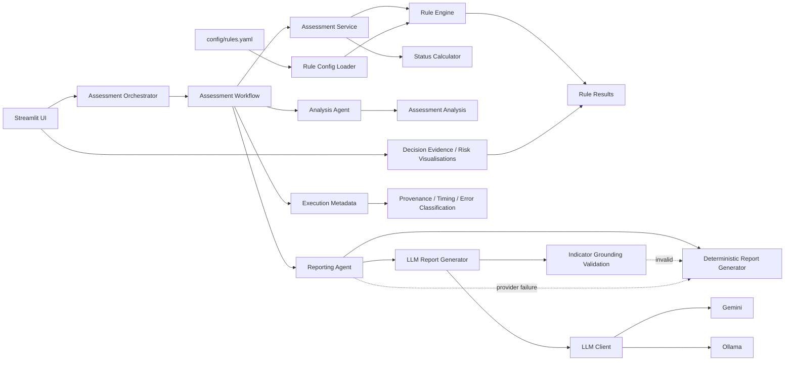

# Architecture Decision Records

This document captures the main architectural decisions behind the Credit Assessment System and explains **why** the system is structured as it is.

## Decision Status

| ID | Decision | Status |
|---|---|---|
| ADR-001 | Deterministic Rule Engine as Decision Authority | Accepted |
| ADR-002 | Separation of Decision and Reporting Layers | Accepted |
| ADR-003 | Externalized Rule Configuration | Accepted |
| ADR-004 | Pluggable Rule Architecture and Registry | Accepted |
| ADR-005 | Provider-Agnostic LLM Abstraction | Accepted |
| ADR-006 | Deterministic Fallback for AI Reporting | Accepted |
| ADR-007 | Immutable Domain Models | Accepted |
| ADR-008 | Thin Presentation Layer | Accepted |
| ADR-009 | Execution Observability and Provenance | Accepted |
| ADR-010 | Grounded LLM Narrative Contract | Accepted |
| ADR-011 | Evidence-Oriented Results UI | Accepted |

---

# ADR-001 — Deterministic Rule Engine as Decision Authority

## Status

Accepted

## Context

Credit assessment requires reproducible and explainable outcomes. The system evaluates financial indicators against explicit business rules and produces structured findings and an overall assessment status.

An LLM is probabilistic and is therefore not an appropriate source of truth for the underlying credit assessment.

## Decision

The **deterministic Rule Engine is the sole decision authority**.

It evaluates rules, produces `RuleResult` objects, resolves severity and provides the inputs used to calculate the overall assessment status.

LLM components must not modify, override or reinterpret the assessment results.

## Rationale

This provides deterministic execution, reproducibility, traceability and a clear separation between business logic and generative AI.

> **The system decides; the AI explains.**

---

# ADR-002 — Separation of Decision and Reporting Layers

## Status

Accepted

## Context

The system has two distinct responsibilities: determining the credit assessment and communicating it in human-readable form.

## Decision

The workflow separates:

```text
AssessmentService
      ↓
Assessment
      ↓
AnalysisAgent
      ↓
AssessmentAnalysis
      ↓
ReportingAgent
```

Reporting implementations consume deterministic analysis objects rather than accessing the rule engine directly.

## Rationale

Each component has a focused responsibility and can be tested independently.

---

# ADR-003 — Externalized Rule Configuration

## Status

Accepted

## Decision

Rule parameters such as thresholds, severity and severity direction are defined in `config/rules.yaml` and loaded through a dedicated configuration layer.

## Rationale

This separates **rule implementation** from **rule parameters**, making business-policy changes easier to review and reproduce.

---

# ADR-004 — Pluggable Rule Architecture and Registry

## Status

Accepted

## Decision

Rules follow a common abstraction and are resolved through a registry/discovery mechanism using their configured `rule_id`.

## Rationale

New indicators can be introduced without adding rule-specific branches to the central assessment service.

---

# ADR-005 — Provider-Agnostic LLM Abstraction

## Status

Accepted

## Decision

LLM access is defined through the `LLMClient` abstraction, with provider-specific implementations such as Gemini, Ollama and a mock client.

## Rationale

This provides provider portability and keeps infrastructure concerns outside reporting-domain logic.

---

# ADR-006 — Deterministic Fallback for AI Reporting

## Status

Accepted

## Decision

LLM-based reporting uses a **deterministic report generator as fallback** when the primary reporting path fails or, when strict grounding is enabled, when the generated narrative does not contain required indicator evidence.

The fallback changes only the report-generation path. It does not alter the assessment or findings.

## Rationale

AI is treated as an enhancement to reporting rather than a mandatory dependency of the credit assessment.

---

# ADR-007 — Immutable Domain Models

## Status

Accepted

## Decision

Core assessment, analysis, report and execution-state objects use immutable data structures where appropriate, including frozen dataclasses.

## Rationale

Immutability reduces the risk that downstream components silently modify facts produced by upstream deterministic processing.

---

# ADR-008 — Thin Presentation Layer

## Status

Accepted

## Decision

`app/` is responsible for presentation, interaction and workflow composition. Business rules, assessment calculations, domain models and LLM abstractions remain in `src/`.

The UI consumes structured domain objects and does not reproduce decision logic.

## Rationale

This keeps the core system reusable and testable outside Streamlit.

---

# ADR-009 — Execution Observability and Provenance

## Status

Accepted

## Decision

Successfully completed workflow executions expose immutable `ExecutionMetadata` containing execution identity, timestamp, reporting mode, generator used, fallback state, error category and phase timings.

Observability is exposed in the Streamlit audit area but does not participate in the credit decision.

## Rationale

This provides execution-level traceability without coupling the current application to persistent observability infrastructure.

> **Observability describes the workflow; it does not decide the credit outcome.**

---

# ADR-010 — Grounded LLM Narrative Contract

## Status

Accepted

## Context

The Executive Report can use an LLM to transform deterministic findings into natural language. In a credit-risk context, a fluent response is not sufficient: the narrative must remain faithful to the supplied evidence.

The system therefore needs an explicit contract controlling what the LLM may say and how it should represent deterministic numerical indicators.

## Decision

The LLM reporting prompt establishes a constrained narrative contract:

- all supplied material findings must be represented;
- supplied numerical indicators and units must be preserved exactly;
- values must not be rounded, recalculated or converted;
- unsupported facts and causal explanations must not be invented;
- specific unsupported areas such as sales volume, pricing, demand, costs, liquidity, cash flow, debt service capacity and financial stability must not be inferred unless provided;
- categories are discussed in source order and at most once;
- category headings, bullets and numbered lists are not used in the executive narrative;
- each material indicator value is mentioned once;
- repeated findings and conclusions are avoided;
- the LLM does not generate the assessment status.

When strict indicator grounding is enabled, the generated narrative is checked against deterministic indicator values. Missing required values cause deterministic fallback.

## Rationale

This creates a practical control between deterministic evidence and generative language without attempting to solve full semantic verification of arbitrary natural-language output.

The architecture therefore protects the two most important properties:

1. the credit judgement remains deterministic;
2. the narrative remains anchored to the evidence supplied to the model.

## Consequences

### Positive

- Numerical evidence is less likely to disappear from the narrative.
- Unsupported causal reasoning is explicitly discouraged.
- The deterministic status remains outside model authority.
- Missing required indicator evidence can activate deterministic fallback.
- Narrative style is consistent across providers.

### Trade-offs

- String-based grounding validation is intentionally narrower than semantic verification.
- Provider outputs can still differ in wording and fluency.
- Prompt and validation contracts require regression tests when changed.

## Alternatives Considered

### Unconstrained LLM narrative

Rejected because it increases the risk of omissions, unsupported inferences and inconsistent numerical representation.

### Full semantic fact-checking pipeline

Deferred because it would introduce additional model dependencies and complexity beyond the current prototype scope.

---

# ADR-011 — Evidence-Oriented Results UI

## Status

Accepted

## Context

A credit assessment interface should explain not only the final status but also how the deterministic rule engine produced it. A single label is insufficient for an operator or academic demonstration of explainability.

The UI therefore needs visual evidence connecting financial data, indicators, rule outcomes, risk drivers and final assessment.

## Decision

The Streamlit Results view follows an operator-oriented hierarchy:

```text
Executive Credit Assessment
        ↓
Decision Evidence
        ↓
Audit trail & methodology
```

The audit area provides deterministic visual evidence through:

- decision-path cards;
- rule-status distribution;
- risk-indicator dashboard;
- filterable rule catalogue;
- risk-driver map by category;
- rule/indicator/value/threshold detail;
- assessed credit data;
- methodology and execution metadata.

UI components read `RuleResult` and workflow domain objects. They do not recompute business rules.

## Rationale

This makes the assessment mechanism inspectable and demonstrates the link between deterministic evidence and the final judgement. It also keeps the primary user flow concise while preserving detailed diagnostics for users who need them.

## Consequences

### Positive

- The final status can be traced back to quantitative evidence.
- Triggered rules become visible risk drivers rather than opaque exceptions.
- The UI scales better as the rule catalogue grows through filtering and prioritisation.
- Presentation logic remains downstream of the decision layer.

### Trade-offs

- The results page contains more visual components than a minimal dashboard.
- The audit area must remain synchronized with domain models and workflow behavior.

## Alternatives Considered

### Display only the final assessment status

Rejected because it provides insufficient explainability.

### Reimplement rule calculations in the UI

Rejected because it would duplicate business logic and risk divergence from the deterministic Rule Engine.

---

# Architecture Principles

The decisions above imply the following principles:

1. **Deterministic logic owns the decision.**
2. **AI is bounded to narrative generation.**
3. **Material narrative evidence must remain grounded in deterministic findings.**
4. **Business rules should be explicit, testable and configurable.**
5. **Components communicate through well-defined domain objects.**
6. **Infrastructure and LLM providers should remain replaceable.**
7. **Failure of an optional AI component must not invalidate the deterministic assessment.**
8. **Presentation code should not own business logic.**
9. **Execution provenance should remain immutable and separate from decision data.**
10. **The UI should explain the decision path without reproducing it.**

# Current Architecture



The architecture intentionally keeps the **assessment path deterministic**, the **LLM path optional and bounded**, the **fallback path deterministic**, and **execution metadata observational rather than decisional**.
